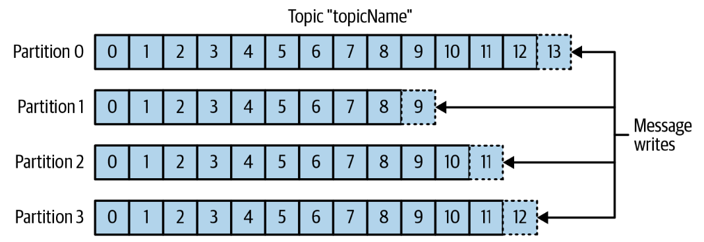

## Kafka: The Definitive Guide

### Глава 1. Знакомьтесь Kafka

Publish/subscribe (pub/sub) messaging - паттерн характеризующийся наличием продюсера (который производит и отправляет сообщение у которого нет конкретного получателя), подписчика (который подписывается на определенные сообщения) и брокер, в котором эти сообщения публикуются.

Message (сообщение) - единица данных в Kafka.

Key (ключ) - сообщение может содержать опциональные метаданные в качестве ключа. Сообщения с одинаковым ключом будут записаны в одну партицию.

Batch - для большей эффективности и снижения оверхеда при записи в топик и партицию сообщения объединяются в батчи (которые обычно сжимаются).

Топик - способ группировки сообщений по категориям.

Партиции (partitions) - Топик разбивается на несколько партиций. Партиции могут быть разнесены по нескольким машинам (то есть один топик может быть масштабирован на несколько нод)

### Глава 2. Установка Kafka

### Глава 3. Kafka продюсеры - запись сообщений в Kafka

### Глава 4. Kafka консюмеры - чтение сообщений из Kafka

### Глава 5. Внутреннее устройство Kafka

#### Из чего состоит кластер

- **ZooKeeper** - поддерживает список состоящих в кластере брокеров
- **Контроллер** - один из брокеров отвечает за выбор ведущих реплик (помимо выполнения обычных функций)

**KRaft** - c 2019 года комьюники кафки 

#### Репликация

### Глава 6. Надежная доставка данных

### Глава 7. Создание конвейеров данных

### Глава 8. Зеркальное копирование между кластерами

### Глава 9. Администрирование Kafka

### Глава 10. Мониторинг Kafka

### Глава 11. Потоковая обработка

[Back](./)